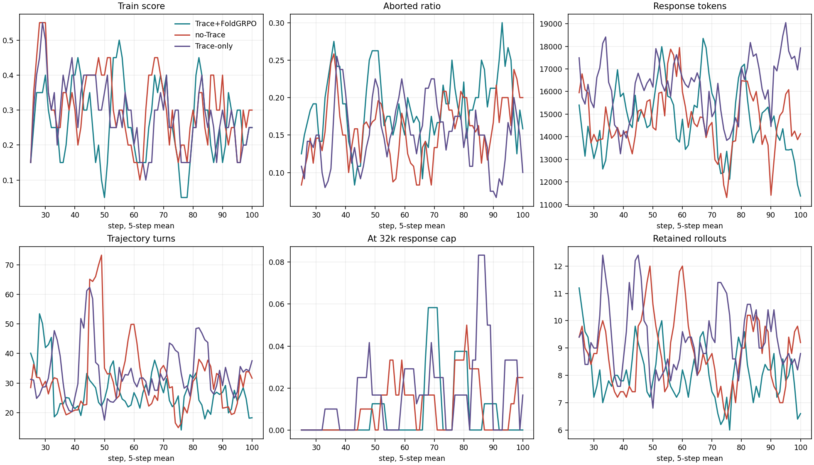
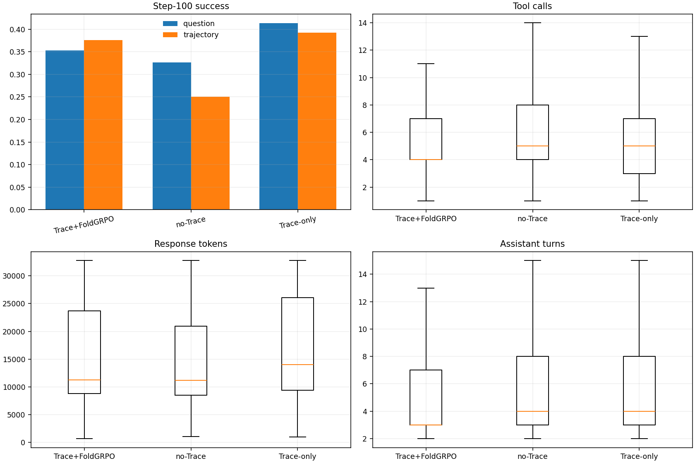
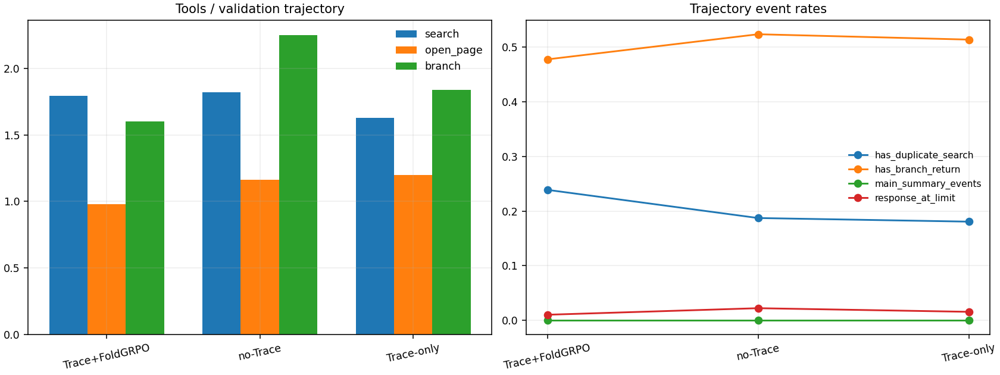

# Qwen3-8B 三组 Rollout / Trajectory / Tool / Token 统计报告

- 日期：2026-09-10
- 三组设置：Trace+FoldGRPO、no-Trace、Trace-only
- 公平训练区间：step 21-100
- Validation 对比：step 100，150 个 BrowseComp 问题
- 分析脚本：[analyze_three_way.py](../../../../01-exps/zhangj-8h-202609/2026-09-10-qwen3-8b-three-way-rollout-analysis/analyze_three_way.py)

> 用户原文中的“on Trace”按上下文解释为“no-Trace”。如其本意是另一组 on-policy Trace 运行，需要另行指定 run path。

## 1. 设置和数据口径

| 设置 | Actor advantage | process reward | 运行 |
|---|---|---|---|
| Trace+FoldGRPO | $A_{FoldGRPO} + 0.2 C_{TRACE}$ | flat | browsecomp_qwen3_8b_trace_long_fix_20260904_2248 |
| no-Trace | $A_{FoldGRPO}$ | flat | browsecomp_qwen3_8b_ablation_no_trace_20260906_0200 |
| Trace-only | $0 A_{FoldGRPO} + 0.2 C_{TRACE}$ | null | browsecomp_qwen3_8b_trace_only_20260909_v2 |

三组的主要 rollout 配置一致：Qwen3-8B、train batch 2、rollout n=2、max_traj=5、prompt 8192、response 32768、model context 40960、max turn 100、max session 10、branch max turn 12、search/open_page observation 上限 8192。Trace-only 的 objective 和 process reward 处理不同，这是实验变量，不是完全同构的 reward 记录。

历史 Trace 保留的逐 step 指标和训练 rollout 从 step 21 开始，因此训练统计统一限制为 21-100，不对缺失 step 1-20 插值。Validation 统一用 step 100。

### 这里的 step 和权重阶段分别是什么

这里的 **step 是优化器更新编号（global training step）**，不是一条 trajectory 内部的‘第几个工具步骤’。训练循环在 step $s$ 先用当时的 actor 生成 rollout，再用这些 rollout 更新一次 actor，随后才执行标成 step $s$ 的 validation。因此：

| 报告内容 | 使用的模型权重 | 是否是单一 checkpoint |
|---|---|---|
| 训练图、训练汇总表、训练轨迹工具表（step 21-100） | 每个 step 更新前的在线 actor；step $s$ 的 rollout 近似对应完成 step $s-1$ 后的权重 | 否，是 80 个连续权重状态产生的数据混合 |
| Step-100 Validation | 完成 step 100 actor 更新后的权重 | 是，等价于 step-100 阶段权重 |
| ‘独立 150 题评测’ | 导出的 `hf_global_step_100` 权重 | 是，step-100 checkpoint 的独立评测 |

所以，训练表回答的是‘整个 step 21-100 训练区间发生了什么’，Step-100 表回答的是‘最终训练到 step 100 的模型表现如何’；二者不能当作同一批 trajectory 横向拼接。

### 三组奖励信号究竟差在哪里

三组都先运行相同的 FoldGRPO reward/advantage 计算管线，但送入 actor PPO loss 的最终 advantage 不同。对第 $i$ 条 trajectory 的可训练 token $t$，可简写为：

$$
A_{i,t}^{\text{actor}} = w_{\text{base}} A_i^{\text{FoldGRPO}} + \alpha_{\text{TRACE}} C_{i,t}^{\text{TRACE}}.
$$

| 设置 | $w_{\text{base}}$ | $\alpha_{\text{TRACE}}$ | actor 实际接收的 advantage | process reward |
|---|---:|---:|---|---|
| Trace+FoldGRPO | 1 | 0.2 | $A^{FoldGRPO}+0.2C^{TRACE}$ | `flat` |
| no-Trace | 1 | 0 | $A^{FoldGRPO}$ | `flat` |
| Trace-only | 0 | 0.2 | $0.2C^{TRACE}$；TRACE mask 外的 token advantage 为 0 | `null` |

因此，**Trace-only 并不只是‘少加一个 $A_{FoldGRPO}$’这么简单**：它把 FoldGRPO outcome advantage 的权重设为 0，同时关闭了另外两组使用的 `flat` process reward。模型结构、rollout 工具、PPO 更新器等主体仍相同。还有两个实验履历上的差别必须保留：Trace+FoldGRPO 是从较早的 trace-recovery checkpoint 续训并从 step 21 留存数据，而 no-Trace、Trace-only 都是 fresh run；Trace-only 还使用了 9 月 9 日新增 `trace_base_weight` 后的较晚代码版本。因此这是有控制但并非只差一个开关的对比，不能视为严格同构消融。

FoldGRPO 先把 trajectory reward 汇总成 $R_i$，再在同一个问题（prompt group）内做相对化；启用标准差归一化时：

$$
A_i^{\text{FoldGRPO}}=\frac{R_i-\mu_g}{\sigma_g+10^{-6}}.
$$

这里的 $R_i$ 含最终环境/答案 reward；`flat` process reward 还会用 process mask 对某些行为 token 施加组内最大/最小 advantage。也就是说，no-Trace 和 Trace+FoldGRPO 都有‘最终是否答对’直接形成的 outcome 学习信号。

本实验的 TRACE credit 来自冻结 Qwen3-8B reference 对 gold answer 的条件似然。令

$$
\ell_k=\frac{1}{|y^*|}\sum_j \log p_{ref}(y_j^*\mid prefix_k,y_{<j}^*), \qquad C_k^{TRACE}=\ell_{k+1}-\ell_k.
$$

如果某一步之后 gold answer 在 reference 看来更容易预测，则 $C_k>0$；反之为负。这个 credit 只广播到对应 decision action span，不覆盖工具 observation 和 padding。当前 frozen-reference 实现的最后一个 decision 没有后继 prefix，因此其局部增量记为 0。

这也回答‘Trace-only 是否仍有答对 loss’：

- 最终答案是否正确的 environment reward **仍会被计算和记录**，FoldGRPO advantage tensor 也会先算出来，便于统计与兼容；
- 但在 Trace-only 中，该 FoldGRPO 项乘以 0，因而**没有一项独立的‘答对交叉熵 loss’或‘答对 reward loss’直接进入 actor 更新**；
- gold answer 仍通过冻结 reference 的 $C^{TRACE}$ 间接指导模型，所以也不能说 Trace-only 完全看不到正确答案信息。

reward、advantage、loss 是三个层次：reward 是环境给一条结果/行为的分数；advantage 是‘它比同题其它采样好多少’的训练权重；loss 是真正反向传播的可微目标。令

$$
\rho_{i,t}(\theta)=\exp(\log\pi_\theta(a_{i,t}|s_{i,t})-\log\pi_{old}(a_{i,t}|s_{i,t})),
$$

本实验的 PPO 截断下界/上界分别为 $\epsilon_{low}=0.20$、$\epsilon_{high}=0.28$，即把 ratio 截到 $[0.8,1.28]$。令

$$
L_t^{(12)}=\max\left(-A_t\rho_t,-A_t\operatorname{clip}(\rho_t,0.8,1.28)\right),
$$

再使用 dual-clip 常数 $c=3$：

$$
L_t=\begin{cases}\min(-3A_t,L_t^{(12)}),&A_t<0,\\L_t^{(12)},&A_t\ge 0,\end{cases} \qquad L_{actor}=\operatorname{masked token mean}_t(L_t).
$$

训练是最小化 $L_{actor}$：正 advantage 会提高相应 token 的概率，负 advantage 会降低它。三组使用同一类 vanilla dual-clip PPO loss，真正变化的是代入其中的 $A_{i,t}$ 以及 process reward 是否启用。三组默认 `entropy_coeff=0`、`use_kl_loss=false`、`use_kl_in_reward=false`，所以本轮没有额外 entropy 或 KL 项进入梯度；日志里的 `actor/ppo_kl`、`rollout_corr/*kl*` 是诊断量，不等于训练了一个 KL loss。FoldGRPO 这类非 GAE 设置也没有启用单独 critic loss。

### 分母定义

- raw rollout：训练 rollout JSONL 中实际保存的 trajectory 行数，包含真实 trajectory，也可能包含为了凑齐 PPO mini-batch 而复制出的 dummy padding 行。每 step 先有 `train_batch_size × n = 2 × 2 = 4` 个初始 generation UID；每个 FoldAgent generation 又可以返回 main 与若干 branch trajectory，最多保留 `max_traj=5` 条，所以每 step 不会固定为 4 行。本数据里 raw count 的每步范围为 4-20。
- retained rollout：每 step 的 `num_unique_gen_uids × avg_trajs_per_gen_uid`。因为 `avg_trajs_per_gen_uid = 非 dummy trajectory 数 / num_unique_gen_uids`，该乘积在当前实现中代数上就是**排除 dummy UID 后的行数**，不是成功数，也不按 score 筛选。CSV 用浮点指标反推，所以称“derived count”比“人工估计”更准确。
- question success：`val/avg_score`。同一个 validation 问题产生多条 trajectory 时，先按该问题/gen_uid 取最高 score，再在 150 个问题上平均；二元 score 下就是“至少一条 trajectory 答对的问题比例”。
- trajectory success：保存的 trajectory 行中 `score=1` 的比例，等于 `val/raw_environment_reward`；每条 trajectory 权重相同，所以 rollout 较多的问题会贡献更多权重。
- aborted ratio：step metrics 的 `response/aborted_ratio`，定义为训练 tensor 中 `response_length == 0` 的 batch 行比例；它不是“答错率”，也不是“达到 32k 上限”。本数据逐 step 核对后发现，它**完全等于 dummy padding 行数 / raw 行数**：trainer 把复制行的训练 mask 清零，所以 tensor 视角长度为 0，但保存到 JSONL 的复制 transcript 仍非空。也就是说，这里的 18.88% / 15.79% / 14.91% 应直白理解成 80 个 step 的**非加权平均 padding fraction**，不能解释成模型生成中止率。按全部行汇总的 pooled padding fraction 则为 18.56% / 16.23% / 14.50%。
- at limit：达到 32768 response token 上限；overflow：越界长度。二者分开统计。
- 重复 search：同一 transcript 中规范化后的 search function body 完全重复，是保守的 exact-repeat 定义。
- fold/context management：模型没有 fold tool；报告分别列 branch、return、branch+return，以及 harness summary/forced return。

### transcript 是什么

本报告里的 **transcript** 不是模型隐藏状态、KV cache 或候选 token 概率表，而是一条 agent trajectory 被保存后的**扁平文本对话记录**。训练器把 dataset prompt 解码到 JSONL 的 `input` 字段，把 prompt 之后的 `response_ids` 解码到 `output` 字段；本报告所说“扫描 transcript”，具体就是扫描这个 `output` 字符串。它大致长成：

```text
assistant
<think>……</think>
<function=search>……</function>
user
……search observation……
assistant
……下一轮推理/工具调用/最终回答……
```

其中通常包含 assistant 生成文本、工具调用标签、作为 user 消息插入的工具 observation、可能的 branch/return 内容以及 harness summary。`response_mask=1` 的位置才是模型生成 token；工具 observation 和 padding 虽也出现在 `response_ids`/transcript 中，但 `response_mask=0`，不作为 actor loss 的动作 token。运行时还存在结构化 `messages` 列表，但当前统计脚本没有直接读取它，而是用行首 `assistant\n` / `user\n` 标记从扁平 `output` 中重新切消息。

因此，一条 transcript 可以理解为“一条已落盘 trajectory 的可读执行日志”。它不是完整原始样本：初始问题/system prompt 在 `input`，而统计中的 transcript 主要指 prompt 之后的执行部分。

### `rollout.n`、branch tool 与 token-prefix 分叉不是一回事

这三个机制要严格区分：

| 机制 | 从哪里开始 | 如何触发 | 本实验是否实际使用 |
|---|---|---|---|
| `rollout.n=2` | 同一个 dataset 初始 prompt | trainer 在生成前把每道题复制 2 份，为两份分配不同 `gen_uid` | 是；这是 FoldGRPO 用来形成同题比较组的两个独立完整 agent rollout |
| `<function=branch>` | main agent 当前 assistant turn 完成后的上下文 | 模型显式输出 branch tool；新 branch 继承当时的完整 main history，再附加 branch task prompt | 是；这是语义/任务级 branch，发生在 turn 边界 |
| 候选 token / prefix sampling branch | 同一个中间 token prefix，例如在位置 $t$ 强制选多个候选 token 后分别续写 | sampler 选择分叉位置并从同一 prefix 启动多个 continuation | **否；当前训练 collector 没有实现** |

当前训练的数据流是：

```text
同一道题的初始 prompt
├─ gen_uid #1：从初始 prompt 独立运行完整 FoldAgent session
│  └─ session 内可由模型调用 <function=branch> 创建任务子会话
└─ gen_uid #2：从初始 prompt 独立运行完整 FoldAgent session
   └─ session 内可由模型调用 <function=branch> 创建任务子会话
```

trainer 先在生成前执行 `batch.repeat(n, interleave=True)`，然后才调用 agent rollout；所以 **用于 FoldGRPO 比较的两个 `n=2` 候选确实都从初始 prompt 开始**，不是在某个共同的中间 token 位置分叉。两个样本保留相同的 question-level `uid`，但有各自的 sample-level `gen_uid`。FoldAgent 因语义 branch 可为一个 `gen_uid` 返回多条 main/branch trajectory；FoldGRPO 在计算组均值和标准差时按 `gen_uid` 去重，避免把同一个初始采样衍生出的多条记录冒充成多个独立 `n` 样本。

也要注意，“只能从初始位置开始”只针对 **同 prefix 的多个备选 rollout**。普通多轮 agent 每一轮当然都会把截至当前 turn 的 transcript/context 重新作为 prompt，继续生成下一个 assistant turn；`<function=branch>` 也会继承调用发生时的 main history。但每个这样的当前 context 默认只采样一个 continuation，代码读取的是一个 completion，并不会把该位置 top-k 候选 token 各自展开成多条尾部 trajectory。当前保存的 `response_top_logprobs`/候选分布只用于周期性 validation 诊断，不参与普通训练分叉。

所以对问题的直接回答是：**按当前 FoldGRPO rollout collector，是的，算法用来比较的独立候选只能从题目的初始 prompt 开始采样；不能自动在任意 token 位置或模型认为关键的位置重新开多个候选-token rollout。** 更准确地说，FoldGRPO 的 advantage 公式本身并不禁止中间 prefix，它只接收已经收集好的 trajectory 和 group ID；限制来自当前 sampler/agent-loop 数据收集实现。

如果要支持你描述的关键位置分叉，需要另外实现 tree/prefix rollout collector。假设在同一 prefix $h_t$ 处选择 $K$ 个候选并分别得到尾部回报 $R_{t,1},\ldots,R_{t,K}$，可以在这个决策节点内构造条件 advantage：

$$
A_{t,k}^{\text{prefix}}=\frac{R_{t,k}-\mu(h_t)}{\sigma(h_t)+\epsilon}, \qquad \mu(h_t)=\frac{1}{K}\sum_{j=1}^{K}R_{t,j}.
$$

这个 advantage 应主要作用于分叉 token 及其后的 tail，不能把同一个 $h_t$ 共享前缀复制 $K$ 次后也重复施加不同梯度。工程上至少要：保存精确 prefix token、messages、工具/环境状态和 old-policy logprob；定义关键位置选择规则；从同一 prefix 强制或采样多个候选 token；分别续写并执行后续工具；按“同一 prefix 决策节点”而不是整道题建立 sibling group；只给分叉后的 tail 分配条件 advantage。对 agentic 工具轨迹，优先在完整 assistant turn 或完整 tool-call 边界分叉会比任意 token 中间分叉安全，否则可能从半个 JSON/function call 开始，且环境状态难以一致恢复。TRACE 当前只是事后给已有 decision span 计算 credit，并不会据此回到高 credit/高不确定位置追加 rollout。

## 2. 训练 Rollout：Step 21-100



**这张图怎么读。** 横轴是 global training step。六个面板都不是单步原值，而是 5-step 简单滑动平均：图上 step $s$ 的点为 $\bar x_s=(x_{s-4}+\cdots+x_s)/5$。所以曲线从 step 25 才开始；step 25 的点汇总 step 21-25。三条线只是三组设置，纵轴单位随面板变化：

1. **Train score**：每 step 的 `reward/avg_score` 再做 5-step 平均，单位是 0-1 比例（乘 100% 才是百分比）。单 step 内先对每个初始 gen_uid 的多条 trajectory 取最高 score，再对 gen_uid 平均。因此它更接近“这批初始 rollout family 至少有一条答对的比例”，不是 raw trajectory 正确率。
2. **Aborted ratio**：训练 tensor 中零 response-mask 行数 / 该 step padded batch 行数，再做 5-step 平均，单位是比例。经逐 step 核验，本图这条线实际就是 dummy padding fraction；0.20 表示约 20% 的 batch 行是补齐行，不代表 20% 的模型调用真的中止。
3. **Response tokens**：每个 step 记录的 response token 均值再做 5-step 平均，单位是 Qwen3 tokenizer token/序列。它包含模型生成 token 和插入 transcript 的工具 observation/context，不等于纯模型输出 token；而且该日志数组包含复制 padding 行，因而是 padded-row 加权均值，不是严格去重后的 retained-trajectory 均值。
4. **Trajectory turns**：图名较容易误导。这里实际画 `reward/avg_num_turns`：先把同一 gen_uid 下 main/branch trajectories 的 `__num_turns__` 相加，再在 gen_uid 间平均，单位是 turn/gen_uid-family，而不是“单条 CSV trajectory 的 assistant 消息数”。
5. **At 32k response cap**：`response_tokens == 32768` 的 padded row 比例，再做 5-step 平均，单位是比例。到达上限不等于 overflow；越界另有字段。训练曲线也可能受复制 padding 行重复计权。
6. **Retained rollouts**：排除 dummy UID 后的 trajectory 行数/step，再做 5-step 平均，单位是条/step；它不是累计数，也不是答对数。

图的用途是看趋势和波动，下面的表才是整个 80-step 区间的汇总。不同面板纵轴尺度不同，不能根据线条视觉高度跨面板比较。

| 设置 | raw rollout（含 padding，条） | retained（去 padding，条） | retained/step（条/step） | step avg score | raw-row trajectory score（含 padding） | padding ratio（日志名 aborted） | turns/gen_uid family | logged response tokens（含 padding） |
|---|---:|---:|---:|---:|---:|---:|---:|---:|
| Trace+FoldGRPO | 792 | 645 | 8.06 | 0.2625 | 0.2866 | 18.88% | 27.26 | 14,639 |
| no-Trace | 844 | 707 | 8.84 | 0.2969 | 0.2915 | 15.79% | 31.25 | 14,734 |
| Trace-only | 876 | 749 | 9.36 | 0.2813 | 0.2660 | 14.91% | 33.60 | 16,326 |

Trace-only 保存和保留的 rollout 最多，日志中的 `aborted ratio`（实际为 padding fraction）最低，logged response tokens 也更长。它的 logged response tokens 比 Trace+FoldGRPO 高约 11.5%，而 generated tokens 的 step 均值反而略低（1388 vs 1452）。Step-100 observation 统计与“额外长度主要来自 observation/context”这一解释一致，但两个统计的阶段和加权方式不同，因此这里只能视为线索，不能据此完成严格归因。

**表格的计算口径。** raw 与 retained 是 80 个 step 的求和；`retained/step = retained / 80`。`step avg score` 和 `turns/gen_uid family` 在 reward manager 中先排除 dummy，再按 gen_uid 聚合；padding ratio 与 logged response tokens 则来自 padded batch。上述 step 指标最后都对 80 个 step 做非加权算术平均，因此每个 step 权重相同。`raw-row trajectory score` 直接扫描全部保存 JSONL 行，复制 padding 也被重复计权。去 padding 后的 trajectory success 实为 180/645=27.91%、210/707=29.70%、203/749=27.10%，与原 raw-row 数值 28.66% / 29.15% / 26.60% 略有差异。

raw 数量不同不是三组训练问题数或 `n` 配置不同：三组每 step 都从 4 个初始 generation UID 开始，但模型触发 branch 的数量不同，每个 generation 最终返回的 main/branch trajectory 数不同，随后 trainer 把结果补到 4 的倍数以满足 PPO mini-batch 整除要求。80 个 step 中，Trace+FoldGRPO 的 raw/step 分布为 4/8/12/16 条，合计 792；no-Trace 与 Trace-only 最高都出现过 20 条，分别合计 844 与 876。逐行比对确认每个 step 的 `raw-retained` 都等于重复 dummy 行数，合计分别为 147/137/127 条。也就是说，组间 raw 差异同时混合了**模型行为导致的真实动态 trajectory 数**和**为了整除而添加的 padding 数**，是潜在训练计算量/样本量混杂因素。

### 训练轨迹工具行为

| 设置 | retained N | tools/traj | search | open_page | branch | return | assistant turns | exact duplicate search | branch+return |
|---|---:|---:|---:|---:|---:|---:|---:|---:|---:|
| Trace+FoldGRPO | 645 | 5.93 | 2.03 | 1.03 | 1.50 | 0.74 | 5.97 | 21.86% | 49.30% |
| no-Trace | 707 | 6.22 | 1.85 | 0.97 | 1.92 | 0.82 | 6.17 | 19.38% | 52.48% |
| Trace-only | 749 | 6.16 | 1.82 | 0.95 | 1.90 | 0.83 | 6.43 | 18.83% | 53.67% |

Trace+FoldGRPO 更偏向 search，后两组更偏向 branch。Trace-only 的总工具量略低于 no-Trace，但 assistant turns 更高，说明其单 turn 的工具密度略低。

**这些列究竟数什么。** 初版脚本曾直接扫描 raw JSONL，因而把 127-147 条 dummy 复制行重复计权。上表是复核后的 **de-padded 口径**：在每个 step 内按 `(input, output, gts, score, response_tokens, generated_tokens)` 完全相同的 tuple 去重并保留第一条；每步去掉的行数恰好都等于 `raw-retained`，最终分母为 645/707/749 条 retained trajectory。原始含 padding 的数值仍可在 `training_trajectory_summary.csv` 中追溯；上表修正值按上述 tuple 去重后重新扫描 transcript 得到。以 `tools/traj` 为例，三组的精确计算分别是 3828/645=5.9349、4397/707=6.2192、4614/749=6.1602。

- `tools/traj`：是的，表示**每条 retained trajectory 中 `<function=...>` 工具调用标签的平均个数**。公式为 `de-padded trajectory 的所有 function 调用数 / retained N`；它包含 search、open_page、branch、return、finish 以及其它 function，不只包含表中单列的四种工具。单位是次/trajectory。
- `search`、`open_page`、`branch`、`return`：对应工具的调用次数均值，单位同样是次/trajectory。一次 assistant turn 可以调用多个工具，所以它们不必等于 turns。
- `assistant turns`：transcript 中以 `assistant\n` 开头的 assistant 消息块数量均值，单位是消息块/trajectory。它不是工具调用数、不是 `<think>` token 数，也不是训练 global step。若旧 transcript 没有 role 标记，脚本才退化为按 `<think>` 块估算。
- `exact duplicate search`：**至少出现一次完全重复 search body 的 trajectory 比例**。脚本提取同一 transcript 的 `<function=search>...</function>` body，将连续空白压成一个空格、首尾去空白并转小写；若 `search 次数 > 去重后的 body 数` 就记 1，否则记 0，最后对 trajectory 求均值。例如完全相同的 `query=foo` 调两次会命中；`foo` 与 `foo details` 即使语义相近也不会命中。它是保守的词面精确重复率，不是“重复调用数 / search 总数”。
- `branch+return`：同时至少有一次 branch 和一次 return 的 trajectory 比例；只检查两类标签是否共同出现，不验证某个 return 是否严格配对某个 branch。

本表的分母是 645/707/749 条 step 21-100 de-padded retained training trajectory，混合了 80 个权重阶段；第 4 节同名表的分母则是 step-100 validation 的 293/315/321 条 trajectory，只使用最终 step-100 权重。因数据阶段和分母都不同，两个 `tools/traj` 不是同一批样本的重复展示，也不能逐行相减解释为“step 100 相对训练初期”的纯变化。

## 3. Step-100 Validation：Rollout 数量和成功率



**这张图怎么读。** 四个面板都只使用完成第 100 次 actor 更新后的 validation 数据，不再跨 step 做滑动平均：

1. 左上 **Step-100 success** 是并排柱状图。question 柱的单位是成功问题/150 个问题，按问题先聚合；trajectory 柱的单位是正确 trajectory/全部保存 trajectory。以 Trace+FoldGRPO 为例，question success 为 53/150=35.33%，trajectory success 为 110/293=37.54%。二者分母不同。
2. 右上 **Tool calls** 是每条 validation trajectory 的总 function 调用数分布，单位是次/trajectory。
3. 左下 **Response tokens** 是完整 response 序列长度分布，单位是 Qwen3 token/trajectory；其中含工具 observation，不是纯 generated token。
4. 右下 **Assistant turns** 是 assistant 消息块数分布，单位是消息块/trajectory，定义与上文相同。

后三个面板是箱线图，不是均值柱：箱内横线是中位数，箱体下/上边是第 25/75 百分位，须线通常延伸到距箱体 1.5×IQR 范围内的最远点；脚本设置 `showfliers=False`，所以范围外离群点没有画出来。三组的中位数按 Trace+FoldGRPO / no-Trace / Trace-only 顺序分别是：Tool calls 4 / 5 / 5 次，Response tokens 11,255 / 11,168 / 14,010 token，Assistant turns 3 / 4 / 4 块。下面表里的均值可能明显高于或低于这些中位线，这是长尾分布下的正常现象。

| 设置 | 问题数（题） | trajectory 数（条） | rollout/问题（条/题） | question success rate | trajectory success rate | easy trajectory success rate | medium trajectory success rate | hard trajectory success rate |
|---|---:|---:|---:|---:|---:|---:|---:|---:|
| Trace+FoldGRPO | 150 | 293 | 1.95 | 0.3533 | 0.3754 | 0.5957 | 0.2178 | 0.3265 |
| no-Trace | 150 | 315 | 2.10 | 0.3267 | 0.2508 | 0.4773 | 0.1491 | 0.1770 |
| Trace-only | 150 | 321 | 2.14 | 0.4133 | 0.3925 | 0.6436 | 0.2742 | 0.2813 |

Trace-only 的 question success 和 trajectory success 都最高；Trace+FoldGRPO 的 hard-trajectory success rate 高于 Trace-only。后三列都是各难度下的 **trajectory-level 成功比例，不是 trajectory 数量**。每个难度虽有 50 道题，但动态 main/branch session 使 easy/medium/hard 的 trajectory 分母不同，所以这些比例不能当作固定 50 题的 question-level 独立评测率。

## 4. Step-100 Validation：工具与轨迹结构



**这张图怎么读。** 它同样只统计 step-100 validation trajectory：

- 左图 **Tools / validation trajectory** 只画了 search、open_page、branch 三类工具的每 trajectory 平均调用次数，单位是次/trajectory。三根柱相加仍不等于下表的 `tools/traj`，因为总工具数还包含 return、finish 和可能的其它 function。具体地，三组左图柱和分别约为 4.38、5.23、4.67 次/trajectory，而表中总工具数为 5.59、6.61、6.08；差额主要正好来自 return 与 finish。
- 右图 **Trajectory event rates** 的横轴仍是三个实验设置，不是时间；连线只为方便看组间差异，不表示随 step 演化。`has_duplicate_search` 是含精确重复 search 的 trajectory 比例，三组依次为 23.89% / 18.73% / 18.07%；`has_branch_return` 是同时含 branch 和 return 的比例，依次为 47.78% / 52.38% / 51.40%；`response_at_limit` 是达到 32768 response token 的比例，依次为 1.02% / 2.22% / 1.56%。这三项的单位均为 0-1 比例。`main_summary_events` 实际是“每 trajectory 的 summary 事件平均次数”（次/trajectory），严格说不是 rate；本批三组都为 0，所以与其它比例共轴不会影响数值，但标签应按这个定义理解。

| 设置 | tools/traj（次/traj） | search（次/traj） | open_page（次/traj） | branch（次/traj） | return（次/traj） | assistant turns（块/traj） | exact duplicate search | branch+return |
|---|---:|---:|---:|---:|---:|---:|---:|---:|
| Trace+FoldGRPO | 5.59 | 1.80 | 0.98 | 1.60 | 0.67 | 5.61 | 23.89% | 47.78% |
| no-Trace | 6.61 | 1.82 | 1.16 | 2.25 | 0.85 | 6.19 | 18.73% | 52.38% |
| Trace-only | 6.08 | 1.63 | 1.20 | 1.84 | 0.79 | 6.25 | 18.07% | 51.40% |

在 step-100 validation 中，Trace-only 比 no-Trace 少 8.1% 总工具调用，差异主要在 branch；open_page 均值略高（1.20 vs 1.16）。这只是行为描述，不能单凭 0.04 次/trajectory 的差值推断它“更直接”或效率更高。Trace+FoldGRPO 总工具最少，但 exact duplicate search 比例最高。

### 成功与失败轨迹条件统计

下表把同一批 step-100 validation trajectory 按 `score>0` 切成 correct/wrong，再分别计算均值。`N` 的单位是条 trajectory；tools/search/open/branch 是次/trajectory；turns 是 assistant 消息块/trajectory；response tokens 是 token/trajectory；duplicate search 是该切片内含至少一次 exact-repeat search 的 trajectory 比例。它是条件描述统计，不控制题目难度、同题 rollout 数或轨迹长度，因而不能单独证明某种工具行为导致成功或失败。

| 设置/结果 | N（条） | tools（次/traj） | search（次/traj） | open（次/traj） | branch（次/traj） | turns（块/traj） | response tokens（token/traj） | duplicate search |
|---|---:|---:|---:|---:|---:|---:|---:|---:|
| Trace+FoldGRPO / correct | 110 | 5.70 | 1.81 | 0.98 | 1.65 | 5.50 | 14,583 | 20.00% |
| Trace+FoldGRPO / wrong | 183 | 5.53 | 1.79 | 0.98 | 1.57 | 5.68 | 15,056 | 26.23% |
| no-Trace / correct | 79 | 4.58 | 1.70 | 1.04 | 0.77 | 3.96 | 12,129 | 12.66% |
| no-Trace / wrong | 236 | 7.29 | 1.86 | 1.20 | 2.75 | 6.93 | 15,434 | 20.76% |
| Trace-only / correct | 126 | 5.77 | 1.58 | 1.37 | 1.57 | 5.79 | 15,797 | 18.25% |
| Trace-only / wrong | 195 | 6.28 | 1.66 | 1.09 | 2.01 | 6.55 | 17,046 | 17.95% |

no-Trace 的失败轨迹相对成功轨迹多 59% 工具调用和约 3,305 response tokens，差异主要来自 branch；这是三组里最明显的“失败与更长扩展相关联”的现象，但条件均值不能证明这些扩展导致失败或一定无效。Trace-only 的失败轨迹也更长，但组间差值较小。Trace+FoldGRPO 的正确/错误工具数量接近，错误轨迹更常伴随 exact-repeat search；同样不能从相关性直接推出因果。

## 5. Tool Observation Token

使用 Qwen3-8B tokenizer，对扁平 transcript 中 search/open_page 后的完整 observation 编码。多个同 turn 调用共享一条 user observation 时只归属一次；内联 observation 使用 `</function>` 到下一个 think/function 的区间，和已有 context-management 审计规则一致。`observation 数` 的单位是条事件；`平均 tokens = 该类 observation token 总数 / observation 事件数`，是 event-weighted 均值，不是先按 trajectory 平均；最大值的单位也是 token。

| 设置 | search observation 数 | 平均 tokens | 最大 tokens | open observation 数 | 平均 tokens | 最大 tokens |
|---|---:|---:|---:|---:|---:|---:|
| Trace+FoldGRPO | 471 | 6,329 | 25,343 | 267 | 2,399 | 20,601 |
| no-Trace | 504 | 5,943 | 25,913 | 339 | 2,097 | 8,347 |
| Trace-only | 462 | 7,305 | 27,120 | 385 | 2,718 | 8,363 |

Trace-only 的 search observation 平均长度比 Trace+FoldGRPO 高 15.4%、比 no-Trace 高 22.9%；open_page observation 也分别高 13.3% 和 29.6%。这与它在 generated tokens 接近时拥有更长 response context 的现象一致，但这里是 Step-100 validation 的 event-weighted observation 均值，不能严格解释训练区间的 padded step 均值。最大 search observation 远超配置中的 8192，是因为这里统计的是保存 transcript 中完整 user observation（可包含组合输出和附加 guidance），不是后端单次搜索结果的硬截断字段。

## 6. Token 上限、超长与 Overflow

| 设置 | train response at-limit（raw rows） | train overlong_masked（条） | 受影响 step（个） | val response at-limit（traj） | val overlong rate | 真正 response overflow（条） |
|---|---:|---:|---:|---:|---:|---:|
| Trace+FoldGRPO | 8/792 (1.01%) | 0 | 0 | 3/293 (1.02%) | 0 | 0 |
| no-Trace | 11/844 (1.30%) | 0 | 0 | 7/315 (2.22%) | 0 | 0 |
| Trace-only | 18/876 (2.05%) | 18 | 4 | 5/321 (1.56%) | 0.67% | 0 |

训练 at-limit 的分子和分母来自含 dummy 复制行的 raw 日志，validation 则没有这类 padding，因此前者不应解释为唯一真实 trajectory 的比例。Validation response token P95 为 30,956 / 30,738 / 31,153；三组都靠近 32,768 上限。Trace-only 的上下文负载最高，训练中也是唯一触发 overlong masking 的设置。三组 generated_at_limit 和 generated overflow 都为 0，response overflow 也为 0，因此不能把 at-limit 样本描述为已经越界。

## 7. 独立 150 题评测

本报告对应的 `trace_long_fix_20260904_2248` 未保留同口径独立 local-Qwen 评测。下面先完整拆开当前 no-Trace、Trace-only 的多种 test 口径，再列历史未训练 Qwen3-8B 与 FoldAgent+TRACE checkpoint；不同列不是同一种 metric，`—` 表示没有运行或没有保存，不能互相补空。

### 7.1 当前 no-Trace 与 Trace-only：同一批答案的多种判分

| 设置 | checkpoint | local normalized exact match | local-Qwen hybrid accepted | 其中：非 exact 但 self-judge 接受 | relaxed diagnostic match | historical strict/TRACE normalized EM（CPU 重算） | fixed DeepSeek-flash accepted |
|---|---|---:|---:|---:|---:|---:|---:|
| no-Trace | step 100 | 21/150 = 14.00% | 24/150 = 16.00% | 3/150 = 2.00% | 43/150 = 28.67% | **20/150 = 13.33%** | **25/150 = 16.67%**（3 API/解析错误） |
| Trace-only | step 100 | 17/150 = 11.33% | 22/150 = 14.67% | 5/150 = 3.33% | 44/150 = 29.33% | **14/150 = 9.33%** | **22/150 = 14.67%**（3 API/解析错误） |

这些列都扫描相同的 150 个已保存最终答案，但规则不同。两组 150/150 都保存了可提取短答案，本次 CPU 重算没有 missing candidate：

- **local normalized exact match**：确定性 `em_score`。它统一大小写、重音和标点，删除括号限定词，忽略部分冠词/介词/年份，并允许若干名字或标题 head 规则；所以它不是逐字符 exact，也不应不加核验地改名为历史的 strict/TRACE EM。
- **local-Qwen hybrid accepted**：先自动接受 local exact；非 exact 且非空的答案再交给本 run 自己的 step-100 Qwen3-8B 作语义 judge。公式是 $H_i=E_i+(1-E_i)J_i$。因此 no-Trace 和 Trace-only 实际用了两套随 policy 变化的 $J_i$，并非统一固定 judge。
- **relaxed diagnostic match**：确定性宽松诊断，除规范化外还接受一方包含另一方、字符相似度不低于 0.9 或字符重叠率不低于 0.9；它只被记录，没有直接决定 hybrid score。
- **historical strict/TRACE normalized EM**：直接复用历史复评脚本的规则：对候选短答案与 gold 做 NFKC、casefold，删除所有 Unicode `P*` 标点和英文冠词 `a/an/the`，合并空白后要求完全相等。当前 `final_answer` 是 `[短答案, 解释, 置信度]`，重算明确取第一个元素；不重新生成轨迹。
- **fixed DeepSeek-flash accepted**：把两组 300 个短答案交给同一个 `deepseek-flash`，temperature 0；仅 `verdict=correct` 且 `confidence≥0.8` 接受，`incorrect`、`abstain`、API 或 JSON 解析错误均 fail-closed。no-Trace 的 20 个 historical-strict 正例全部被接受，另接受 5 个非 strict 语义等价答案；Trace-only 的 14 个 strict 正例全部被接受，另接受 8 个非 strict 答案。

按难度拆分后，表头与总表保持同一顺序：

| 设置 | 难度（每档 50 题） | local normalized exact | local-Qwen hybrid | 非 exact self-judge-only | relaxed diagnostic | historical strict/TRACE EM | fixed DeepSeek-flash accepted |
|---|---|---:|---:|---:|---:|---:|---:|
| no-Trace | Easy | 17/50 = 34% | 19/50 = 38% | 2/50 = 4% | 21/50 = 42% | **16/50 = 32%** | **20/50 = 40%**（2 err） |
| no-Trace | Medium | 3/50 = 6% | 4/50 = 8% | 1/50 = 2% | 12/50 = 24% | **3/50 = 6%** | **4/50 = 8%**（0 err） |
| no-Trace | Hard | 1/50 = 2% | 1/50 = 2% | 0/50 = 0% | 10/50 = 20% | **1/50 = 2%** | **1/50 = 2%**（1 err） |
| Trace-only | Easy | 16/50 = 32% | 18/50 = 36% | 2/50 = 4% | 23/50 = 46% | **13/50 = 26%** | **18/50 = 36%**（1 err） |
| Trace-only | Medium | 1/50 = 2% | 4/50 = 8% | 3/50 = 6% | 14/50 = 28% | **1/50 = 2%** | **4/50 = 8%**（1 err） |
| Trace-only | Hard | 0/50 = 0% | 0/50 = 0% | 0/50 = 0% | 7/50 = 14% | **0/50 = 0%** | **0/50 = 0%**（1 err） |

可见 relaxed 命中数远高于最终 hybrid（43 vs 24、44 vs 22），不能把 relaxed 当作正确率。两组在 local exact、hybrid、historical strict 和 fixed DeepSeek 下都是 no-Trace 较高；historical strict 差 6 题（20 vs 14），fixed DeepSeek 差 3 题（25 vs 22），各自 self-judge hybrid 只差 2 题（24 vs 22）。评分器会改变差值大小，因此必须并列披露。

当前 hybrid 对应的独立 rollout 行为统计如下；score 和 Easy/Medium/Hard 均指 hybrid，而不是 exact 或 relaxed：

| 设置 | hybrid score | Easy | Medium | Hard | turns（块/题） | search（次/题） | open（次/题） | branch（次/题） | summary（次/题） |
|---|---:|---:|---:|---:|---:|---:|---:|---:|---:|
| no-Trace | 24/150 = 16.00% | 38% | 8% | 2% | 15.64 | 1.87 | 3.25 | 0.96 | 0.167 |
| Trace-only | 22/150 = 14.67% | 36% | 8% | 0% | 14.36 | 2.13 | 2.32 | 1.14 | 0.067 |

独立 test 与 training validation 使用不同 grader 路径。Trace-only 在 training validation 更高，但独立 test 的 local exact 少 4 题、self-judge hybrid 少 2 题，不能据此宣称稳定泛化提升。

### 7.2 历史未训练 Qwen3-8B 与 FoldAgent+TRACE checkpoint

历史 run 为 `browsecomp_qwen3_8b_trace_importfix_20260818_0205`。需要纠正名称：它虽然是 **FoldAgent + frozen-reference TRACE**，保存配置却是 `algorithm.adv_estimator=agentgrpo`，不是当前意义的 `FoldGRPO+TRACE`。下面完整列出用户指定的未训练模型、step 100 和 step 300：

| 历史对象 | checkpoint | 历史旧 scorer | strict/TRACE normalized EM | DeepSeek accepted |
|---|---|---:|---:|---:|
| 未训练 Qwen3-8B | base | 未运行 | 8/150 = 5.33% | 12/150 = 8.00% |
| FoldAgent+TRACE（AgentGRPO） | step 100 | 54/150 = 36.00% | 16/150 = 10.67% | 23/150 = 15.33% |
| FoldAgent+TRACE（AgentGRPO） | step 300 | 59/150 = 39.33% | 14/150 = 9.33% | 27/150 = 18.00% |

历史三列也必须分开理解：旧 scorer 是当时训练链路使用、后来确认会显著高估的评分；strict/TRACE normalized EM 是历史修订报告的确定性主口径；DeepSeek accepted 是统一外部语义 judge 的旁路复核，不参与历史训练 reward。尤其 step 300 的旧 scorer 39.33% 与 strict EM 9.33% 相差 30 个百分点。

历史难度分层按同样列顺序展示；step 100 的 strict 与 DeepSeek 只有总计，分层结果未保存，因此明确写 `—`：

| 历史对象 | 难度 | 历史旧 scorer | strict/TRACE normalized EM | DeepSeek accepted |
|---|---|---:|---:|---:|
| 未训练 Qwen3-8B | Easy | 未运行 | 5/50 = 10% | 8/50 = 16% |
| 未训练 Qwen3-8B | Medium | 未运行 | 3/50 = 6% | 4/50 = 8% |
| 未训练 Qwen3-8B | Hard | 未运行 | 0/50 = 0% | 0/50 = 0% |
| FoldAgent+TRACE step 100 | Easy | 16/50 = 32% | — | — |
| FoldAgent+TRACE step 100 | Medium | 18/50 = 36% | — | — |
| FoldAgent+TRACE step 100 | Hard | 20/50 = 40% | — | — |
| FoldAgent+TRACE step 300 | Easy | 23/50 = 46% | 9/50 = 18% | 20/50 = 40% |
| FoldAgent+TRACE step 300 | Medium | 21/50 = 42% | 5/50 = 10% | 6/50 = 12% |
| FoldAgent+TRACE step 300 | Hard | 15/50 = 30% | 0/50 = 0% | 1/50 = 2% |

### 7.3 对齐后的初步比较边界

| 可比性项目 | 当前 no-Trace / Trace-only | 历史未训练 / FoldAgent+TRACE |
|---|---|---|
| run 时间 | 202609 | 202608 |
| estimator | FoldGRPO（Trace-only 将 base advantage 置 0） | AgentGRPO + TRACE |
| 主要确定性列 | local normalized exact；新增 historical strict CPU 重算 | strict/TRACE normalized EM |
| 语义 judge | 每个 run 自己的 step-100 Qwen3-8B；另补统一 `deepseek-flash` | 历史统一 `deepseek-v4-flash` 旁路 |
| 能否直接排序 | 当前两组 historical strict 可同口径比较；hybrid judge 不固定 | 历史 run 内 strict/DeepSeek 可同列初步比较 |
| 能否跨实验族合并 | historical strict 规则已对齐，可作量级初比；生成协议仍不同 | 同左 |

因此这些表适合观察量级和发现评分敏感性。当前两组已补跑历史 strict normalization，可把 no-Trace 13.33%、Trace-only 9.33%、历史 base 5.33%、历史 step-100 10.67%、历史 step-300 9.33% 放在同一列作**初步量级比较**；当前两组也已用同一 `deepseek-flash` 得到 16.67% 与 14.67%。但 run、agent 协议、采样预算与训练设置不同，且历史 DeepSeek model id 是 `deepseek-v4-flash`，仍不是受控排行榜。当前复评每组各 3 个解析错误按 fail-closed 计 0，故必须连同错误数一起引用。

当前统一 judge 的 [机器汇总](../../../../01-exps/zhangj-8h-202609/2026-09-10-qwen3-8b-three-way-rollout-analysis/data/deepseek_flash_fixed_judge/summary.json) 与 [300 条逐例 verdict](../../../../01-exps/zhangj-8h-202609/2026-09-10-qwen3-8b-three-way-rollout-analysis/data/deepseek_flash_fixed_judge/cases.jsonl) 已保存；文件不包含 API key。

文件跳转：[zhangj-calvin 中的实验谱系、配置与误读说明](../../../../00-docs/experiments/zhangj-calvin/foldagent-1/2026-08-30-Qwen3-4B-Thinking训练设计错误复盘与全量训练推理方案/README.md)；[历史 Qwen3-8B FoldAgent/TRACE 150 题完整修订报告](../../../../00-docs/experiments/wanghb-calvin/foldagent-1/2026-08-24-Qwen3-8B-FoldAgent-TRACE科研汇报-修订版/README.md)。

## 8. 与公开 FoldAgent Trace 诊断的关系

参考页面：[Qwen3-8B FoldAgent TRACE 实验报告](https://calvinlin011010.github.io/Agentic_RL/20260825-FoldAgent_Trace/)，源码入口：[CalvinLin011010/Agentic_RL](https://github.com/CalvinLin011010/Agentic_RL)。公开中文增强诊断报告针对 29 个显式 main+branch 重建 case，报告：

- 成功 9/29；
- 重复 search case 比例 44.8%；
- 主上下文 fold case 比例 65.5%；
- 成功后仍有冗余候选 3/9；
- 失败但词面 coverage 达 100% 为 4/20。

本报告借用了“逐轨迹工具事件、重复检索、context fold、token evidence 长度、成功/失败条件切片”的分析框架，但不把公开数字当基线。原因是公开报告只有 29 个诊断 case，并采用更宽的重复检索/主 fold 定义；本地统计覆盖 293-321 条 validation trajectory，exact duplicate search 更保守。公开页面可从服务器访问；GitHub 源码在本次核验时经代理返回 503，因此未复制其代码或中间数据。

## 9. 综合判断

1. Trace-only 确实改变了行为：保留 trajectory 更多、训练 padding fraction 最低、validation success 最高，但轨迹和 observation 最长，并出现额外 overlong masking。这里不能把日志名为 aborted ratio 的数值解释为模型中止率。
2. no-Trace 的主要问题是失败轨迹膨胀：错误样本工具调用和 branch 明显多于正确样本。
3. Trace+FoldGRPO validation 较稳健且总工具最少，但 exact duplicate search 最高；hard trajectory success 最高。
4. Trace-only 在本轮 validation 上最好，但独立 local-Qwen 评测略低于 no-Trace，说明 grader 路径差异或单 seed 方差仍然很大。
5. 三组 rollout 数量并不完全相同，Trace-only 的更高 retained count 是潜在 compute/sample confound。下一轮应固定实际 retained trajectories 或报告按有效 trajectory 归一化的训练预算。
6. 建议至少做 3 个 matched seeds，并新增 semantic duplicate query、每题累计 tool budget、fold 前后 evidence retention、success-per-1k-context-token 和 overlong-mask 后的样本去向统计。

## 10. 产物

- [逐 step 训练指标](../data/training_step_metrics.csv)
- [逐 trajectory 明细（训练部分含 dummy padding；validation 不含）](../../../../01-exps/zhangj-8h-202609/2026-09-10-qwen3-8b-three-way-rollout-analysis/data/trajectory_details.csv)
- [训练 trajectory 汇总（原始脚本口径，含 dummy padding）](../data/training_trajectory_summary.csv)
- [Validation trajectory 汇总](../data/validation_trajectory_summary.csv)
- [Step-100 validation 汇总](../data/validation_step100_summary.csv)
- [独立评测汇总](../data/independent_evaluation_summary.csv)
- [来源与定义 manifest](../data/source_manifest.json)
- [运行日志](../../../../01-exps/zhangj-8h-202609/2026-09-10-qwen3-8b-three-way-rollout-analysis/run.log)
